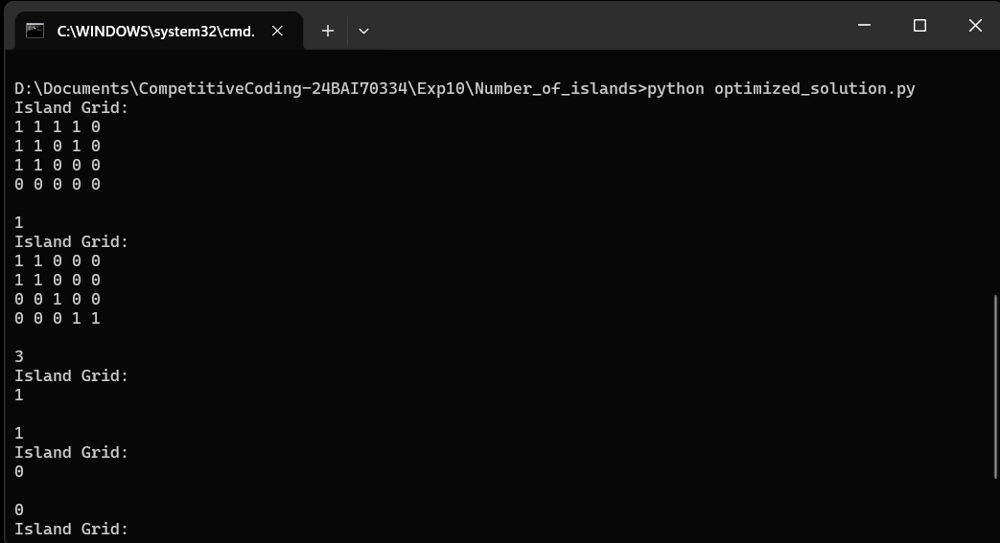

# LeetCode #200 — Number of Islands

**Subject:** CC-II (24CSP-339) · Experiment 3.3, Problem 1
**Difficulty:** Medium | Graph · DFS · BFS · Matrix

## 1. Problem Statement
Given an `m x n` 2-D binary grid representing a map of `'1'`s (land) and `'0'`s
(water), return the number of islands. An island is surrounded by water and is
formed by connecting adjacent lands **horizontally or vertically** (diagonal
neighbours do NOT count).

- `m == grid.length`, `n == grid[i].length`
- `1 ≤ m, n ≤ 300`
- `grid[i][j]` is `'0'` or `'1'`

## 2. Project Structure
```
.
├── brute_force_solution.py   # Approach: separate visited matrix + DFS
├── optimized_solution.py     # Approach: in-place DFS / flood fill (from the doc)
└── README.md                  # This file
```

Both files are self-contained and can be run independently — each will print
the results of the five test cases below.

## 3. Test Cases

| # | Grid | Expected Output | Why |
|---|------|------------------|-----|
| 1 | `11110 / 11010 / 11000 / 00000` | `1` | All connected `'1'`s form a single large island |
| 2 | `11000 / 11000 / 00100 / 00011` | `3` | Three separate clusters of `'1'`s, each surrounded by water |
| 3 | `[["1"]]` | `1` | Single land cell forms exactly one island |
| 4 | `[["0"]]` | `0` | No land at all |
| 5 | `[["1","0"],["0","1"]]` | `2` | The two `'1'`s touch only diagonally, so they are separate islands |

## 4. How to Run

```bash
python brute_force_solution.py
python optimized_solution.py

```

## 5. Approaches

### Brute Force — Separate Visited Matrix
Scan every cell. Whenever an unvisited land cell is found, run a DFS to mark
the whole connected island as visited using a separate boolean matrix,
incrementing the island counter once per DFS call. Keeps the original grid
untouched, at the cost of `O(m × n)` extra memory for the visited matrix.

### Optimized — In-Place DFS (Flood Fill)
Instead of a separate visited structure, overwrite each land cell with `'0'`
as it is visited ("sinking" the island). This removes the extra `O(m × n)`
visited-matrix overhead entirely, since the grid itself doubles as the
visited record. This is the optimal solution provided in the experiment
sheet — taken as-is rather than reworked.

| Approach | Time Complexity | Space Complexity |
|----------|------------------|-------------------|
| Brute Force (Visited Matrix) | O(m × n) | O(m × n) extra visited matrix + recursion stack |
| Optimized (In-Place DFS) | O(m × n) | O(m × n) recursion stack only (no extra matrix) |

## 6. Edge Cases Handled
- All water → `0`
- All land → `1`
- Single cell `'1'` → `1`, single cell `'0'` → `0`
- 1×n or m×1 grid → counts runs of consecutive `'1'`s
- Diagonal adjacency → NOT connected, counted as separate islands
- Large grid (300×300) → each of the 90,000 cells visited at most once, `O(m×n)`

## 7. Key Takeaways
- Flood-fill / connected-component counting is the standard pattern for this
  class of problem.
- In-place marking (`'1'` → `'0'`) avoids allocating a separate visited
  structure, saving `O(m × n)` extra space.
- Only 4-directional (up/down/left/right) neighbours count; diagonals are
  excluded.
- A queue-based BFS or a Union-Find (Disjoint Set Union) structure are valid
  alternative approaches — useful for avoiding deep recursion or for handling
  a dynamically-updated grid, respectively.

## 8. Output Screenshot




## 9. Related Problems
- LeetCode #695 — Max Area of Island
- LeetCode #130 — Surrounded Regions
- LeetCode #994 — Rotting Oranges
- LeetCode #286 — Walls and Gates
- LeetCode #417 — Pacific Atlantic Water Flow
