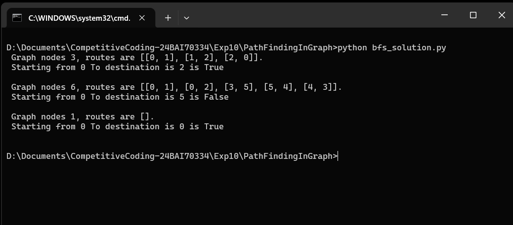
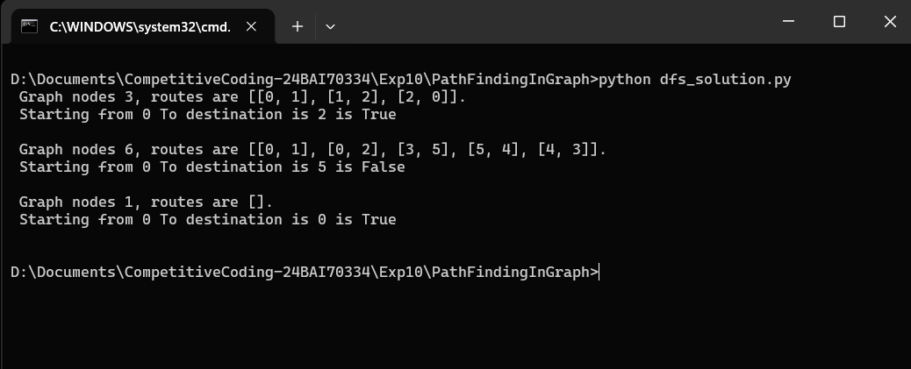
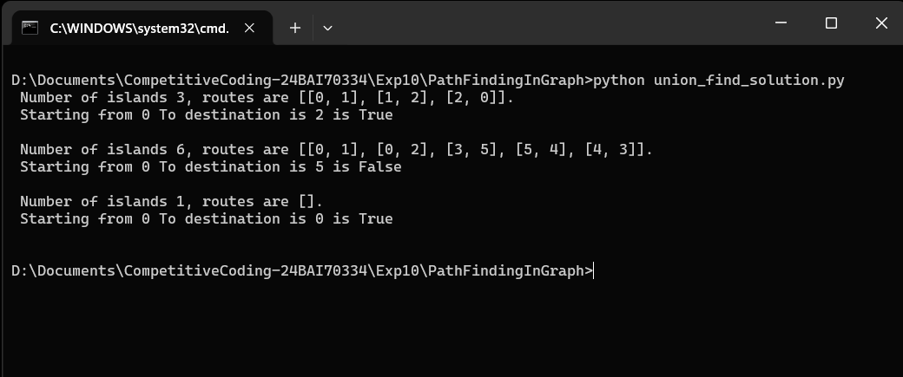

# Experiment 3.3.2 — Find if Path Exists in Graph

**Course:** Practical Experiment Module · Chandigarh University · Unit 3, Experiment 6

## 1. Aim
To implement a program that, given an undirected graph with `n` nodes and a list of
edges, determines whether a valid path exists between a given source and destination
node.

## 2. Problem Statement
- Input: `n` (number of nodes), `edges` (list of undirected edges), `source`, `destination`
- Output: `True` if a path exists between `source` and `destination`, else `False`

## 3. Project Structure
```
.
├── bfs_solution.py          # Solution using Breadth-First Search
├── dfs_solution.py          # Solution using Depth-First Search (recursive)
├── union_find_solution.py   # Solution using Union-Find / Disjoint Set Union
└── README.md                # This file
```

Each solution file is self-contained and can be run independently — just run
the file and it will print the results of the three test cases below.

## 4. Test Cases

| # | Input | Expected Output | Explanation |
|---|-------|------------------|-------------|
| 1 | `n=3, edges=[[0,1],[1,2],[2,0]], source=0, destination=2` | `True` | Direct edge 2-0, or path 0 → 1 → 2 |
| 2 | `n=6, edges=[[0,1],[0,2],[3,5],[5,4],[4,3]], source=0, destination=5` | `False` | `{0,1,2}` and `{3,4,5}` are separate components |
| 3 | `n=1, edges=[], source=0, destination=0` | `True` | Source and destination are the same node |

## 5. How to Run

```bash
python bfs_solution.py
python dfs_solution.py
python union_find_solution.py

# or run all three together and see a pass/fail table:
python test_all.py
```

## 6. Approaches Compared

| Approach | Idea | Time Complexity | Space Complexity |
|----------|------|------------------|-------------------|
| BFS | Explore graph level by level using a queue | O(V + E) | O(V + E) |
| DFS | Explore as deep as possible using recursion | O(V + E) | O(V + E) |
| Union-Find | Group nodes into components using disjoint sets | O(V + E·α(V)) ≈ O(V + E) | O(V) |

## 7. Learning Outcomes
1. Understand graph representation using an adjacency list.
2. Learn how breadth-first search (BFS) explores a graph level by level.
3. Improve logical thinking and problem-solving skills in DSA.
4. Understand how connected components determine reachability between nodes.
5. Understand implementation of the same problem using multiple approaches in Python.

## 8. Output Screenshot







