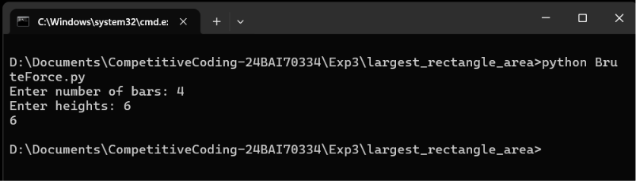
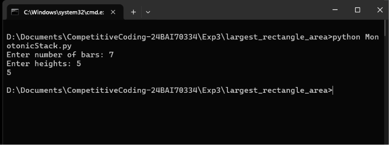

# Largest Rectangle Area

This repository contains Python implementations to find the **largest rectangular area in a histogram** using two different approaches.

The project demonstrates both a simple brute-force solution and an optimized **Monotonic Stack** solution.

---

## Files

| File                  | Description                                                               |
| --------------------- | ------------------------------------------------------------------------- |
| `BruteForce.py`       | Finds the largest rectangle using the brute-force approach.               |
| `MonotonicStack.py`   | Finds the largest rectangle using the optimized monotonic stack approach. |
| `BruteForce.png`      | Screenshot of the Brute Force approach.                                   |
| `MonotoniceStack.png` | Screenshot of the Monotonic Stack approach.                               |

---

## Approaches

## 1. Brute Force Approach

* Consider every possible starting bar.
* Extend the rectangle to the right.
* Keep track of the minimum height within the selected range.
* Calculate the rectangle area for each range.
* Store the maximum area found.

### Time Complexity

| Operation        | Complexity |
| ---------------- | ---------: |
| Traversal        |    `O(n²)` |
| Area Calculation |     `O(1)` |
| Total            |    `O(n²)` |
| Extra Space      |     `O(1)` |

---

## 2. Monotonic Stack Approach

* Use a **Monotonic Increasing Stack** to store indices of histogram bars.
* Traverse the histogram from left to right.
* When a smaller bar is encountered, calculate the maximum rectangle possible using the taller bars in the stack.
* Continue until all bars have been processed.
* This allows each bar to be pushed and popped at most once.

### Time Complexity

| Operation        | Complexity |
| ---------------- | ---------: |
| Traversal        |     `O(n)` |
| Stack Operations |     `O(n)` |
| Total            |     `O(n)` |
| Extra Space      |     `O(n)` |

---

## Example

Input:

```text
2 1 5 6 2 3
```

Output:

```text
10
```

The largest rectangle is formed by the bars:

```text
5 6
```

with:

```text
Height = 5
Width = 2

Area = 5 × 2 = 10
```

---

## Screenshots

### Brute Force Approach



### Monotonic Stack Approach



---

## Language

* Python 3

---

## How to Run

### Brute Force Approach

```bash
python BruteForce.py
```

### Monotonic Stack Approach

```bash
python MonotonicStack.py
```

---

## Purpose

This repository demonstrates different approaches for solving the **Largest Rectangle in Histogram** problem.

It covers:

* Histogram-based problems.
* Brute-force problem solving.
* Monotonic Stack.
* Stack-based optimization.
* Time and space complexity comparison.
* Efficient algorithm design.

---

## Complexity Comparison

| Approach        | Time Complexity | Space Complexity |
| --------------- | --------------: | ---------------: |
| Brute Force     |         `O(n²)` |           `O(1)` |
| Monotonic Stack |          `O(n)` |           `O(n)` |

---

## Conclusion

The **Brute Force approach** is simple and useful for understanding the problem but requires `O(n²)` time.

The **Monotonic Stack approach** improves the time complexity to `O(n)`, making it more efficient for large input sizes.
