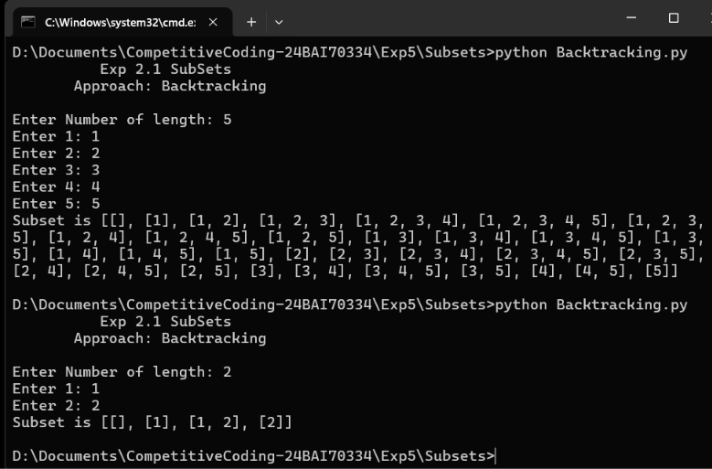
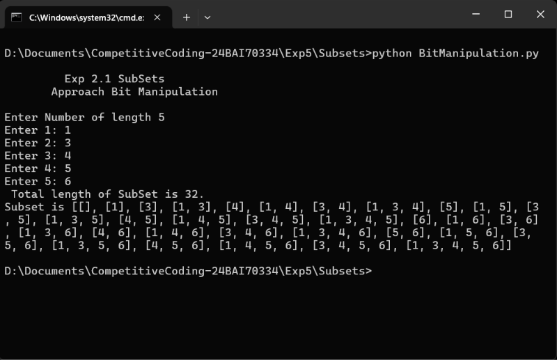

# Subsets (Power Set)

This repository contains Python implementations to generate **all possible subsets (Power Set)** of a given set using two different approaches.

The project demonstrates both the **Backtracking** technique and the **Bit Manipulation** technique for solving the subsets problem.

---

## Files

| File                  | Description                                         |
| --------------------- | --------------------------------------------------- |
| `Backtracking.py`     | Generates all subsets using recursive backtracking. |
| `BitManipulation.py`  | Generates all subsets using binary bit masking.     |
| `Backtracking.png`    | Screenshot of the Backtracking approach.            |
| `BitManipulation.png` | Screenshot of the Bit Manipulation approach.        |

---

# Approaches

## 1. Backtracking Approach

Backtracking recursively decides whether to **include** or **exclude** each element.

### Algorithm

1. Start with an empty subset.
2. Store the current subset in the result.
3. Include the next element and recurse.
4. Remove the last element (backtrack).
5. Repeat until all subsets are generated.

### Dry Run

**Input:** `[1, 2, 3]`

| Step | Start Index | Current Subset | Result Added |
| ---: | ----------: | -------------- | ------------ |
|    1 |           0 | `[]`           | `[]`         |
|    2 |           1 | `[1]`          | `[1]`        |
|    3 |           2 | `[1, 2]`       | `[1, 2]`     |
|    4 |           3 | `[1, 2, 3]`    | `[1, 2, 3]`  |
|    5 |           2 | `[1, 3]`       | `[1, 3]`     |
|    6 |           1 | `[2]`          | `[2]`        |
|    7 |           2 | `[2, 3]`       | `[2, 3]`     |
|    8 |           1 | `[3]`          | `[3]`        |

**Final Result**

```text
[]
[1]
[1,2]
[1,2,3]
[1,3]
[2]
[2,3]
[3]
```

### Time Complexity

| Operation        |  Complexity |
| ---------------- | ----------: |
| Generate Subsets |     `O(2ⁿ)` |
| Copy Subsets     |      `O(n)` |
| Total            | `O(n × 2ⁿ)` |
| Extra Space      |      `O(n)` |

---

## 2. Bit Manipulation Approach

Each subset is represented by a binary number.

For **n** elements, there are **2ⁿ** binary combinations.

### Binary Representation

**Input:** `[1, 2, 3]`

| Binary | Selected Elements | Subset    |
| ------ | ----------------- | --------- |
| `000`  | None              | `[]`      |
| `001`  | 3                 | `[3]`     |
| `010`  | 2                 | `[2]`     |
| `011`  | 2,3               | `[2,3]`   |
| `100`  | 1                 | `[1]`     |
| `101`  | 1,3               | `[1,3]`   |
| `110`  | 1,2               | `[1,2]`   |
| `111`  | 1,2,3             | `[1,2,3]` |

### Dry Run

| Mask | Binary | Generated Subset |
| ---: | ------ | ---------------- |
|    0 | `000`  | `[]`             |
|    1 | `001`  | `[3]`            |
|    2 | `010`  | `[2]`            |
|    3 | `011`  | `[2,3]`          |
|    4 | `100`  | `[1]`            |
|    5 | `101`  | `[1,3]`          |
|    6 | `110`  | `[1,2]`          |
|    7 | `111`  | `[1,2,3]`        |

### Time Complexity

| Operation      |                  Complexity |
| -------------- | --------------------------: |
| Generate Masks |                     `O(2ⁿ)` |
| Check Bits     |                      `O(n)` |
| Total          |                 `O(n × 2ⁿ)` |
| Extra Space    | `O(1)` *(excluding output)* |

---

## Example

**Input**

```text
[1, 2, 3]
```

**Output**

```text
[]
[1]
[2]
[3]
[1,2]
[1,3]
[2,3]
[1,2,3]
```

---

# Screenshots

## Backtracking Approach



## Bit Manipulation Approach



---

## Language

* Python 3

---

## How to Run

### Backtracking

```bash
python Backtracking.py
```

### Bit Manipulation

```bash
python BitManipulation.py
```

---

## Complexity Comparison

| Approach         |        Time |                       Space |
| ---------------- | ----------: | --------------------------: |
| Backtracking     | `O(n × 2ⁿ)` |                      `O(n)` |
| Bit Manipulation | `O(n × 2ⁿ)` | `O(1)` *(excluding output)* |

---

## Purpose

This repository demonstrates two standard techniques for generating the **Power Set** of a given set.

It covers:

* Recursive Backtracking
* Bit Manipulation
* Binary Masking
* Power Set Generation
* Recursion Tree Concept
* Time and Space Complexity Analysis

---

## Conclusion

The **Backtracking approach** is intuitive and widely used for recursive subset generation, while the **Bit Manipulation approach** provides a compact iterative solution using binary masks. Both generate all **2ⁿ** possible subsets efficiently.
