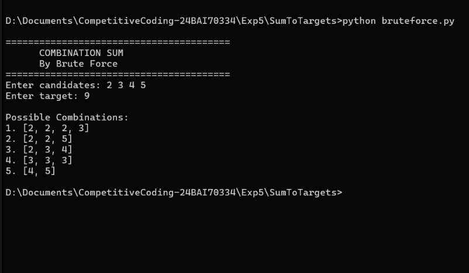
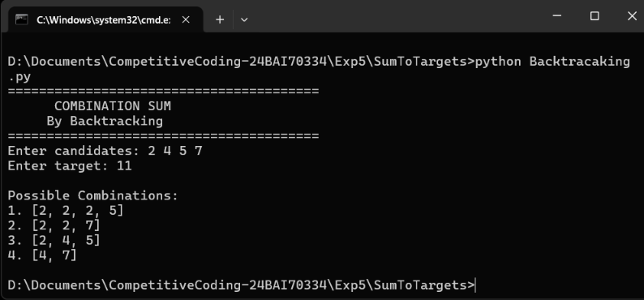

# Sum To Target (Combination Sum)

This repository contains Python implementations to solve the **Combination Sum** problem using two different approaches.

The project demonstrates both a **Brute Force** solution and an optimized **Backtracking** solution for finding all unique combinations whose sum equals a target value.

---

## Problem Statement

You are given:

* An array of **distinct integers** `candidates`
* A target value `target`

Find **all unique combinations** of numbers whose sum equals the target.

### Rules

* A number can be used **unlimited times**.
* Duplicate combinations such as `[2,3]` and `[3,2]` are **not allowed**.
* The order of elements inside a combination does not matter.

### Example

**Input**

```text
candidates = [2,3,6,7]
target = 7
```

**Output**

```text
[
  [2,2,3],
  [7]
]
```

---

## Files

| File               | Description                                                            |
| ------------------ | ---------------------------------------------------------------------- |
| `bruteforce.py`    | Finds all valid combinations using the brute force recursive approach. |
| `Backtracaking.py` | Finds all combinations using optimized backtracking with pruning.      |
| `Bruteforce.png`   | Screenshot of the Brute Force approach.                                |
| `Backtracking.png` | Screenshot of the Backtracking approach.                               |

---

# Approaches

## 1. Brute Force Approach

The brute force approach recursively tries every possible candidate until the target becomes zero or negative.

### Algorithm

1. Start from the first candidate.
2. Include the current number multiple times.
3. Explore every possible combination.
4. Store combinations whose sum equals the target.
5. Ignore combinations that exceed the target.

### Dry Run

**Input:** `candidates = [2,3,6,7]`, `target = 7`

| Step | Current Combination | Remaining Target | Result  |
| ---: | ------------------- | ---------------: | ------- |
|    1 | `[]`                |                7 | —       |
|    2 | `[2]`               |                5 | —       |
|    3 | `[2,2]`             |                3 | —       |
|    4 | `[2,2,3]`           |                0 | ✅ Add   |
|    5 | `[2,3]`             |                2 | Invalid |
|    6 | `[3]`               |                4 | —       |
|    7 | `[6]`               |                1 | Invalid |
|    8 | `[7]`               |                0 | ✅ Add   |

**Final Result**

```text
[[2,2,3], [7]]
```

### Time Complexity

| Operation        |          Complexity |
| ---------------- | ------------------: |
| Recursive Search | `O(2ⁿ)` *(approx.)* |
| Extra Space      |              `O(n)` |

---

## 2. Backtracking Approach

Backtracking improves the search by **pruning unnecessary paths**. Once the remaining target becomes negative, recursion stops immediately.

### Algorithm

1. Start from an index.
2. Choose a candidate.
3. Reduce the remaining target.
4. Reuse the same candidate if needed.
5. Backtrack by removing the last element.
6. Stop exploring when the remaining target is negative.

### Dry Run

**Input:** `candidates = [2,3,6,7]`, `target = 7`

| Step | Start Index | Current Combination | Remaining Target |
| ---: | ----------: | ------------------- | ---------------: |
|    1 |           0 | `[]`                |                7 |
|    2 |           0 | `[2]`               |                5 |
|    3 |           0 | `[2,2]`             |                3 |
|    4 |           1 | `[2,2,3]`           |              0 ✅ |
|    5 |           1 | `[2,3]`             |                2 |
|    6 |           3 | `[7]`               |              0 ✅ |

**Final Result**

```text
[[2,2,3], [7]]
```

### Time Complexity

| Operation           |             Complexity |
| ------------------- | ---------------------: |
| Backtracking Search | `O(2ⁿ)` *(worst case)* |
| Extra Space         |                 `O(n)` |

---

## Example

### Input

```text
Candidates = [2,3,6,7]
Target = 7
```

### Output

```text
[
  [2,2,3],
  [7]
]
```

---

# Screenshots

## Brute Force Approach



## Backtracking Approach



---

## Language

* Python 3

---

## How to Run

### Brute Force

```bash
python bruteforce.py
```

### Backtracking

```bash
python Backtracaking.py
```

---

## Complexity Comparison

| Approach     |                     Time |  Space |
| ------------ | -----------------------: | -----: |
| Brute Force  |                  `O(2ⁿ)` | `O(n)` |
| Backtracking | `O(2ⁿ)` *(with pruning)* | `O(n)` |

---

## Purpose

This repository demonstrates two recursive techniques for solving the **Combination Sum** problem.

It covers:

* Recursive problem solving
* Backtracking
* State-space exploration
* Pruning invalid paths
* Unique combination generation
* Time and space complexity analysis

---

## Conclusion

The **Brute Force approach** explores every possible combination and is useful for understanding recursion.

The **Backtracking approach** is more efficient because it prunes unnecessary recursive branches while still generating all valid unique combinations.
