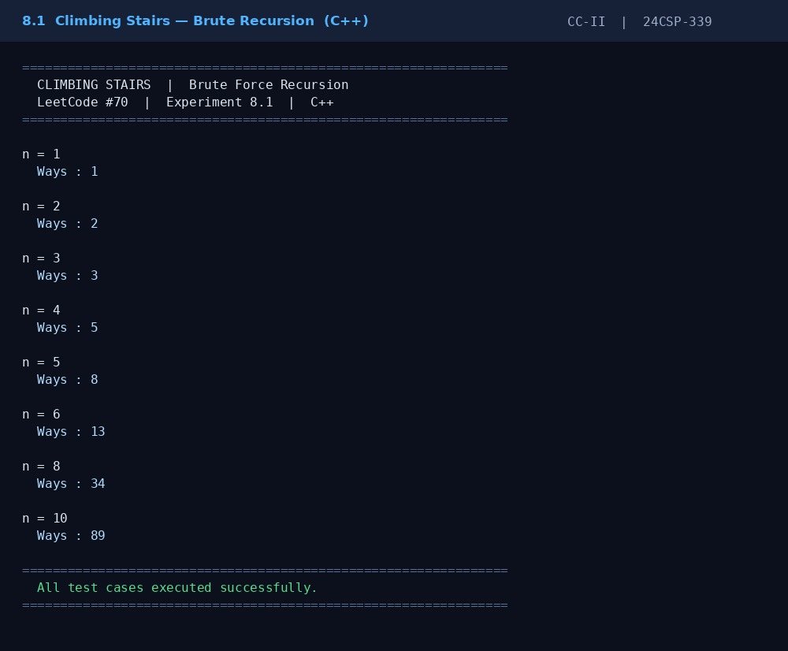
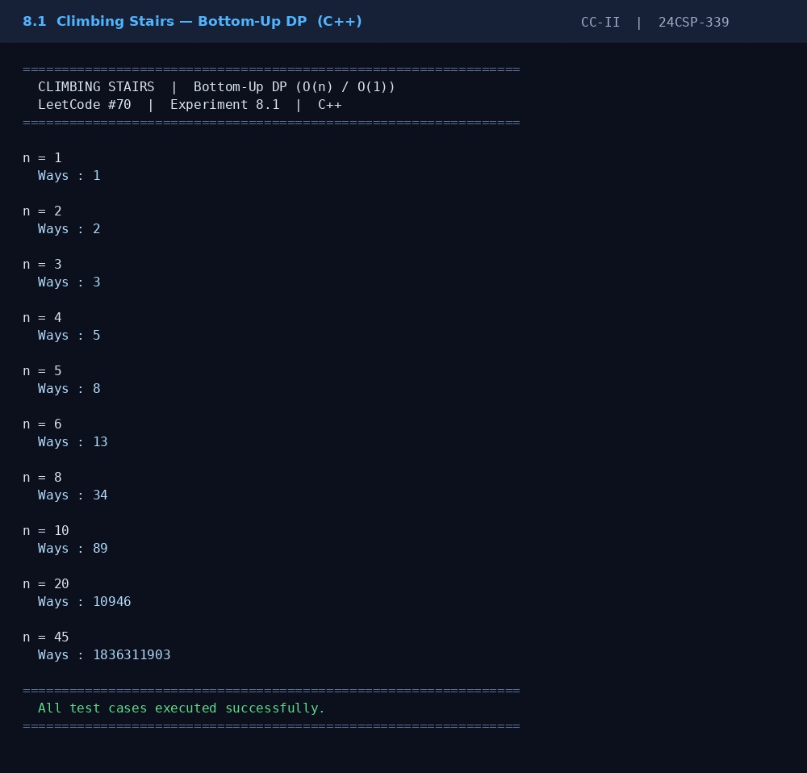

# Climbing Stairs

This repository contains **C++ implementations** of the **Climbing Stairs** problem using two different approaches.

The project compares the traditional recursive solution with the optimized Dynamic Programming solution.

---

## Files

| File                        | Description                                        |
| --------------------------- | -------------------------------------------------- |
| `climbing_stairs_brute.cpp` | Solves the problem using recursive brute force.    |
| `climbing_stairs_dp.cpp`    | Solves the problem using Dynamic Programming (DP). |
| `output_brute.jpg`          | Output screenshot of the brute force approach.     |
| `output_dp.jpg`             | Output screenshot of the DP approach.              |

---

## Approaches

## 1. Brute Force (Recursion)

* Try every possible way to reach the top.
* From each step, either climb **1** or **2** stairs.
* Recursively calculate all possible combinations.
* Simple to understand but inefficient for large values of **n**.

### Time Complexity

| Operation | Complexity |
| --------- | ---------- |
| Time      | O(2ⁿ)      |
| Space     | O(n)       |

---

## 2. Dynamic Programming

* Store previously computed results.
* Each state depends on the previous two states.
* Avoids repeated recursive calculations.
* Much faster and suitable for larger inputs.

### Time Complexity

| Operation | Complexity |
| --------- | ---------- |
| Time      | O(n)       |
| Space     | O(n)       |

---

## Example

**Input**

```text
n = 5
```

**Output**

```text
Number of ways = 8
```

Explanation:

```text
1+1+1+1+1
1+1+1+2
1+1+2+1
1+2+1+1
2+1+1+1
1+2+2
2+1+2
2+2+1
```

---

## Screenshots

### Brute Force Output



### Dynamic Programming Output



---

## Language

* C++

---

## How to Run

Compile Brute Force:

```bash
g++ climbing_stairs_brute.cpp -o brute
./brute
```

Compile Dynamic Programming:

```bash
g++ climbing_stairs_dp.cpp -o dp
./dp
```

---

## Purpose

This repository demonstrates two approaches for solving the **Climbing Stairs** problem.

It covers:

* Recursive problem solving
* Dynamic Programming optimization
* Time and space complexity comparison
* Understanding overlapping subproblems
* Efficient algorithm design in C++
