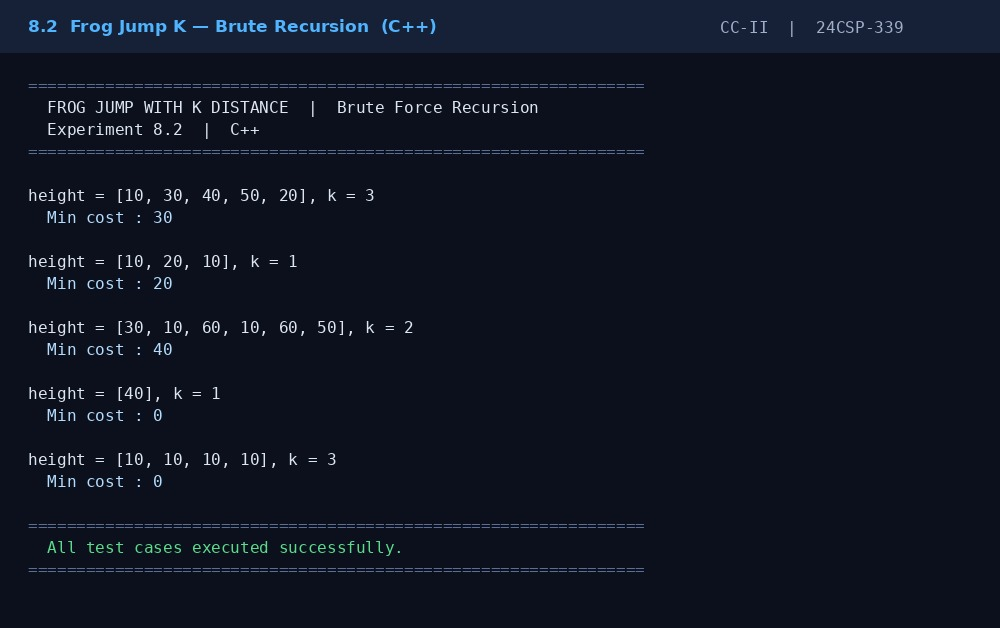
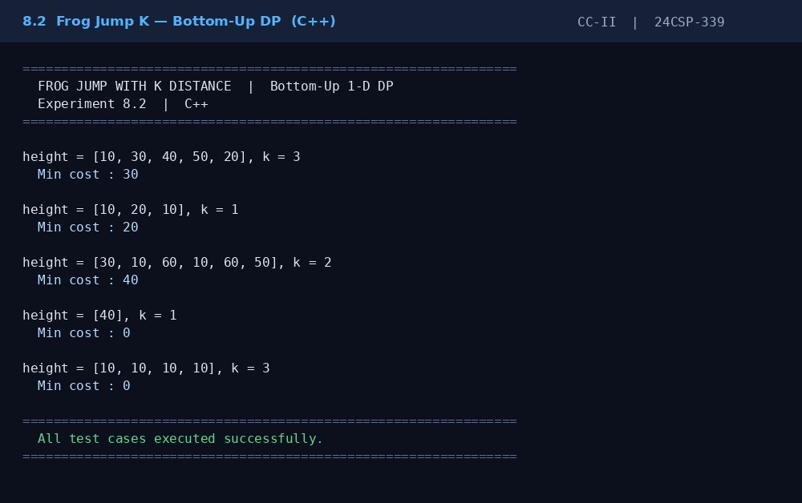

# Frog Jump

This repository contains **C++ implementations** of the **Frog Jump** problem using two different approaches.

The project compares the recursive brute force solution with the optimized Dynamic Programming solution for finding the minimum energy required to reach the last stone.

---

## Files

| File                  | Description                                               |
| --------------------- | --------------------------------------------------------- |
| `frog_jump_brute.cpp` | Solves the Frog Jump problem using recursive brute force. |
| `frog_jump_dp.cpp`    | Solves the problem using Dynamic Programming (DP).        |
| `output_brute.jpg`    | Output screenshot of the brute force approach.            |
| `output_dp.jpg`       | Output screenshot of the DP approach.                     |

---

## Approaches

## 1. Brute Force (Recursion)

* Start from the first stone.
* At each position, the frog can jump **1** or **2** stones.
* Calculate the energy cost recursively for every possible path.
* Returns the minimum energy required to reach the last stone.

### Time Complexity

| Operation | Complexity |
| --------- | ---------- |
| Time      | O(2ⁿ)      |
| Space     | O(n)       |

---

## 2. Dynamic Programming

* Store the minimum energy required for each stone.
* Each state depends on the previous one or two stones.
* Eliminates repeated recursive calculations.
* Efficiently computes the minimum total energy.

### Time Complexity

| Operation | Complexity |
| --------- | ---------- |
| Time      | O(n)       |
| Space     | O(n)       |

---

## Example

**Input**

```text
Heights = [10, 20, 30, 10]
```

**Output**

```text
Minimum Energy = 20
```

**Explanation**

```text
Jump 10 → 20 → 10

Energy = |20-10| + |10-20|
       = 10 + 10
       = 20
```

---

## Screenshots

### Brute Force Output



### Dynamic Programming Output



---

## Language

* C++

---

## How to Run

Compile Brute Force:

```bash
g++ frog_jump_brute.cpp -o brute
./brute
```

Compile Dynamic Programming:

```bash
g++ frog_jump_dp.cpp -o dp
./dp
```

---

## Purpose

This repository demonstrates two approaches for solving the **Frog Jump** problem.

It covers:

* Recursive problem solving
* Dynamic Programming optimization
* Minimum energy path calculation
* Time and space complexity comparison
* Efficient algorithm design in C++
