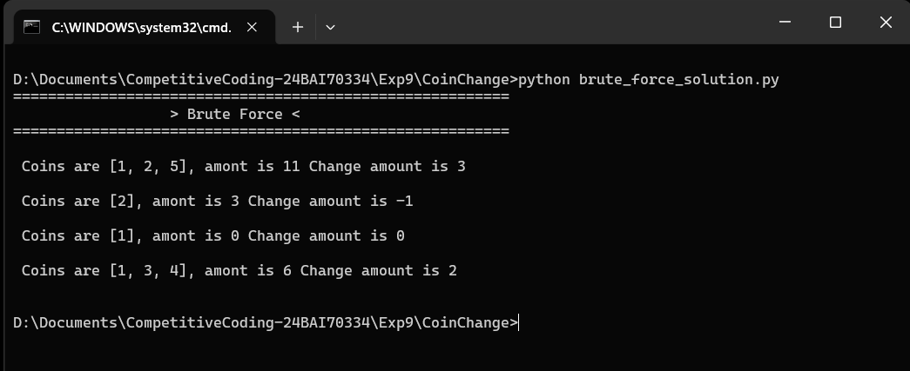
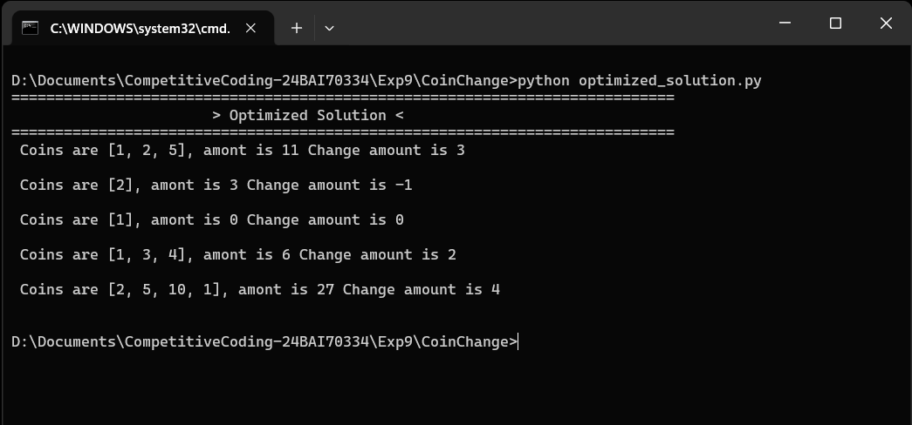

# LeetCode #322 — Coin Change

**Subject:** CC-II (24CSP-339) · Experiment 3.2, Problem 1
**Difficulty:** Medium | Dynamic Programming · 1-D DP · Unbounded Knapsack

## 1. Problem Statement
You are given an array `coins` of different denominations and an integer
`amount` representing a total sum of money. Return the fewest number of
coins needed to make up that amount. If the amount cannot be formed by any
combination of the coins, return `-1`. You may use an unlimited number of
each coin.

- `1 <= coins.length <= 12`
- `1 <= coins[i] <= 2^31 - 1`
- `0 <= amount <= 10^4`

## 2. Project Structure
```
.
├── brute_force_solution.py   # From the doc: plain recursion, O(c^amount)
├── optimized_solution.py     # From the doc: bottom-up DP, O(amount × c)
└── README.md                 # This file
```

Both files are taken directly from the experiment sheet (the brute force is
a Python translation of the sheet's own pseudocode; the optimized solution
is its exact given Python code) — no extra/self-made approach was needed
here since the doc already provides a real optimal solution.

Each file is self-contained — just run it directly, no shared runner script.

## 3. Test Cases

| # | coins | amount | Expected Output | Why |
|---|-------|--------|------------------|-----|
| 1 | `[1,2,5]` | `11` | `3` | 11 = 5 + 5 + 1 uses 3 coins, the fewest possible |
| 2 | `[2]` | `3` | `-1` | No combination of 2s can total an odd 3 |
| 3 | `[1]` | `0` | `0` | An amount of 0 needs no coins at all |
| 4 | `[1,3,4]` | `6` | `2` | 6 = 3 + 3 uses 2 coins; greedy 4+1+1 would use 3 |
| 5 | `[2,5,10,1]` | `27` | `4` | 27 = 10 + 10 + 5 + 2 uses 4 coins |


## 4. How to Run

```bash
python brute_force_solution.py
python optimized_solution.py
```

## 5. Approaches

### Brute Force — Plain Recursion
To make a target `t`, try every coin `c <= t` and recurse on `t - c`, adding
1 for the coin used. `solve(t) = 1 + min(solve(t - c))` over all valid
coins, with `solve(0) = 0`. Recomputes the same sub-amounts many times, so
it grows exponentially and times out for large amounts.

### Optimized — Bottom-Up DP (Coins over Amounts)
Build the answer for every amount from `0` up to the target. `dp[a]` is the
fewest coins summing to exactly `a`. `dp[0] = 0`; for each amount `a` and
coin `c <= a`, `dp[a] = min(dp[a], dp[a-c] + 1)`. Filling amounts low to
high guarantees every dependency is already computed.

| Approach | Time Complexity | Space Complexity |
|----------|------------------|-------------------|
| Brute Force | O(c^amount) | O(amount) recursion depth |
| Optimized (Bottom-Up DP) | O(amount × c) | O(amount) |

## 6. Edge Cases Handled
- `amount = 0` → always `0`
- No valid combination → `-1`
- Coin of value 1 present → any amount is reachable
- Coin larger than amount → never used in the optimal answer
- Greedy fails → `coins=[1,3,4], amount=6` needs 2 coins, not 3
- Large amount (up to 10⁴) → DP array sized `amount + 1`

## 7. Key Takeaways
- 1-D DP over amounts: `dp[a]` is the fewest coins summing to `a`, built
  from smaller amounts.
- Unbounded knapsack: each coin can be reused, so every denomination is
  retried at each amount.
- Sentinel for impossibility: initialize unreachable amounts to a large
  value (`amount + 1`) and return `-1` if it survives.
- Greedy (largest-coin-first) is not sufficient — it can miss the optimal
  combination.

## 8. Output Screenshot





## 9. Related Problems
- LeetCode #518 — Coin Change II
- LeetCode #279 — Perfect Squares
- LeetCode #377 — Combination Sum IV
- LeetCode #983 — Minimum Cost For Tickets
