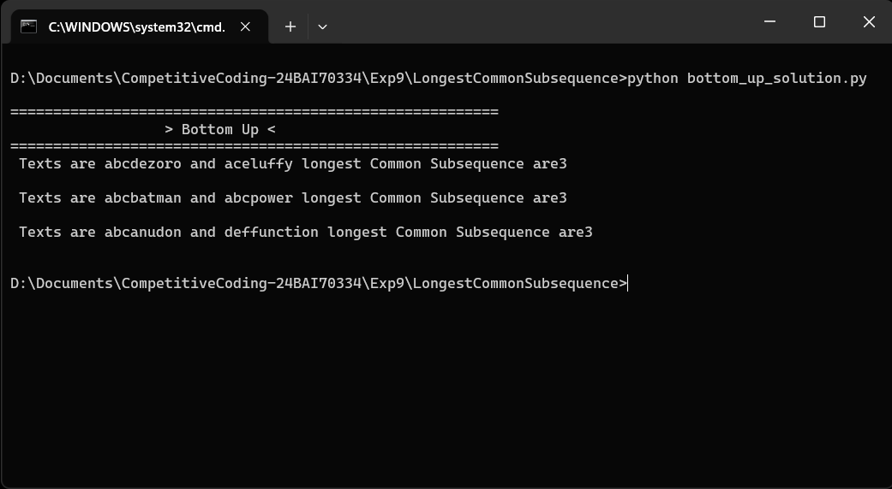
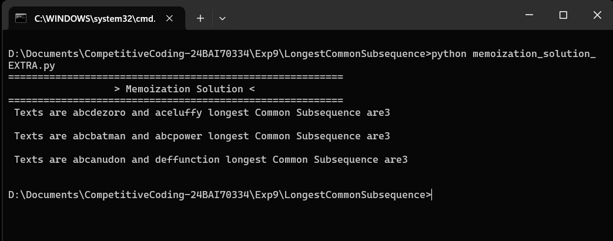
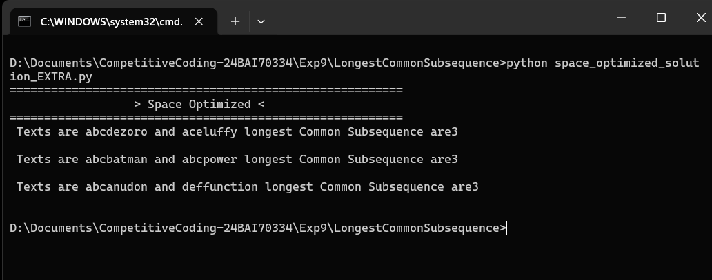

# Experiment 3.2.2 — Longest Common Subsequence

**Course:** Practical Experiment Module · Chandigarh University · Unit 3, Experiment 4

## 1. Aim
To implement a program that, given two sequences, finds the length of their
longest common subsequence (LCS) — the longest run of characters that appears
in the same relative order (though not necessarily contiguously) in both
strings.

## 2. Project Structure
```
.
├── bottom_up_solution.py              # From the doc: bottom-up DP, O(m×n) time/space
├── memoization_solution_EXTRA.py      # EXTRA: top-down recursion + memoization
├── space_optimized_solution_EXTRA.py  # EXTRA: bottom-up DP with rolling array, O(n) space
└── README.md                          # This file
```


Each file is self-contained — just run it directly, no shared runner script.

## 3. Test Cases

| # | text1 | text2 | Expected Output | Explanation |
|---|-------|-------|------------------|-------------|
| 1 | `"abcde"` | `"ace"` | `3` | LCS is `"ace"` |
| 2 | `"abc"` | `"abc"` | `3` | Identical strings — whole string is the LCS |
| 3 | `"abc"` | `"def"` | `0` | No characters in common |

## 4. How to Run

```bash
python bottom_up_solution.py
python memoization_solution_EXTRA.py
python space_optimized_solution_EXTRA.py
```

## 5. Approaches

| Approach | Source | Idea | Time | Space |
|----------|--------|------|------|-------|
| Bottom-Up DP | From the doc | Fill a 2-D table `dp[i][j]` from smaller subproblems | O(m × n) | O(m × n) |
| Top-Down Memoization | Extra | Same recurrence, solved recursively with caching | O(m × n) | O(m × n) |
| Space-Optimized DP | Extra | Bottom-up, but only keeps two rows at a time | O(m × n) | O(n) |

## 6. Learning Outcomes
1. Understand the dynamic-programming approach to subsequence problems.
2. Learn how to build and fill a 2D DP table from overlapping subproblems.
3. Improve logical thinking and problem-solving skills in DSA.
4. Understand the difference between a subsequence and a substring.
5. Understand implementation in C++, Java, and Python.

## 7. Output Screenshot







## 8. Reference Books
1. *Data Structures and Algorithms Made Easy* — Narasimha Karumanchi
2. *Problem Solving with Algorithms and Data Structures Using Python* — Brad Miller and David Ranum
3. *The C++ Programming Language* — Bjarne Stroustrup
4. *Core Java* — Cay S. Horstmann and Gary Cornell
