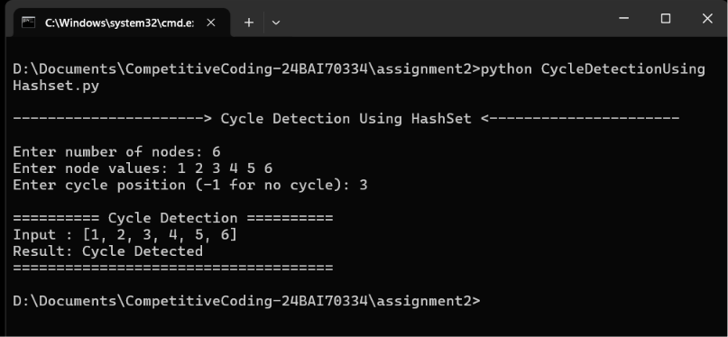
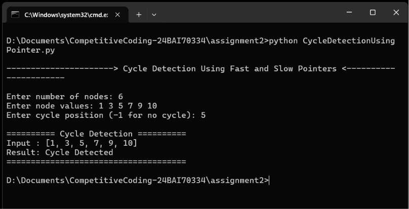
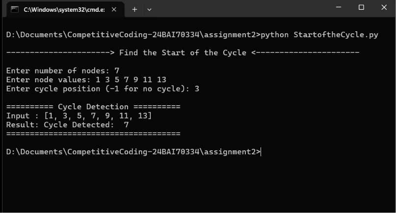

# Linked List Cycle Detection

This repository contains Python implementations for **detecting cycles in a singly linked list** and finding the **starting point of the cycle** using different approaches.

The project demonstrates both a hash set based solution and an optimized pointer-based solution.

---

## Files

| File                             | Description                                                      |
| -------------------------------- | ---------------------------------------------------------------- |
| `CycleDetectionUsingHashset.py`  | Detects whether a cycle exists in a linked list using a HashSet. |
| `CycleDetectionUsingPointer.py`  | Detects a cycle using the two-pointer technique.                 |
| `StartoftheCycle.py`             | Detects the cycle and finds the node where the cycle begins.     |
| `CycleDetectionUsingHashset.png` | Screenshot of the HashSet approach.                              |
| `CycleDetectionUsingPointer.png` | Screenshot of the Pointer approach.                              |
| `StartoftheCycle.png`            | Screenshot of the Start of Cycle approach.                       |

---

## Approaches

## 1. Cycle Detection Using HashSet

The HashSet approach keeps track of the nodes that have already been visited.

* Traverse the linked list.
* Store each visited node in a HashSet.
* If a node is encountered again, a cycle exists.
* If `None` is reached, there is no cycle.

### Time Complexity

| Operation      | Complexity |
| -------------- | ---------: |
| Traversal      |     `O(n)` |
| HashSet Lookup |     `O(1)` |
| Total          |     `O(n)` |
| Extra Space    |     `O(n)` |

---

## 2. Cycle Detection Using Pointers

The pointer-based approach uses **Floyd's Cycle Detection Algorithm**, also known as the **Tortoise and Hare Algorithm**.

Two pointers are used:

* **Slow pointer** moves one node at a time.
* **Fast pointer** moves two nodes at a time.

If the linked list contains a cycle, the two pointers will eventually meet.

### Time Complexity

| Operation          | Complexity |
| ------------------ | ---------: |
| Traversal          |     `O(n)` |
| Pointer Operations |     `O(n)` |
| Total              |     `O(n)` |
| Extra Space        |     `O(1)` |

### Advantages

* Does not require extra memory.
* Uses only two pointers.
* More space-efficient than the HashSet approach.

---

## 3. Finding the Start of the Cycle

This approach not only detects a cycle but also finds the **node where the cycle begins**.

The algorithm uses Floyd's Cycle Detection technique.

### Steps

1. Use `slow` and `fast` pointers to detect a cycle.
2. If they meet, a cycle exists.
3. Move one pointer back to the head.
4. Move both pointers one step at a time.
5. The point where they meet again is the **start of the cycle**.

### Time Complexity

| Operation           | Complexity |
| ------------------- | ---------: |
| Cycle Detection     |     `O(n)` |
| Finding Cycle Start |     `O(n)` |
| Total               |     `O(n)` |
| Extra Space         |     `O(1)` |

---

## Example

Consider the following linked list:

```text
1 → 2 → 3 → 4 → 5
        ↑       ↓
        └───────┘
```

Here, the linked list contains a cycle.

The cycle starts at:

```text
3
```

Therefore:

```text
Cycle Exists: True
Start of Cycle: 3
```

---

## Screenshots

### Cycle Detection Using HashSet



### Cycle Detection Using Pointers



### Start of the Cycle



---

## Language

* Python 3

---

## How to Run

### HashSet Approach

```bash
python CycleDetectionUsingHashset.py
```

### Pointer Approach

```bash
python CycleDetectionUsingPointer.py
```

### Start of Cycle Approach

```bash
python StartoftheCycle.py
```

---

## Complexity Comparison

| Approach            | Time Complexity | Space Complexity |
| ------------------- | --------------: | ---------------: |
| HashSet             |          `O(n)` |           `O(n)` |
| Two Pointers        |          `O(n)` |           `O(1)` |
| Find Start of Cycle |          `O(n)` |           `O(1)` |

---

## Purpose

This repository demonstrates different techniques for working with **cycles in linked lists**.

It covers:

* Linked list traversal.
* Cycle detection.
* HashSet-based cycle detection.
* Floyd's Cycle Detection Algorithm.
* Tortoise and Hare technique.
* Finding the starting node of a cycle.
* Time and space complexity comparison.

---

## Conclusion

The **HashSet approach** is straightforward and easy to understand, but it requires `O(n)` extra space.

The **Two-Pointer approach** detects cycles in `O(n)` time with `O(1)` extra space, making it more memory efficient.

The **Start of Cycle approach** extends Floyd's algorithm to determine the exact node where the cycle begins.
