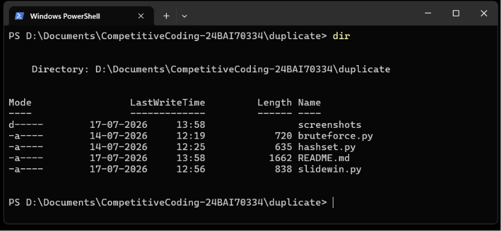
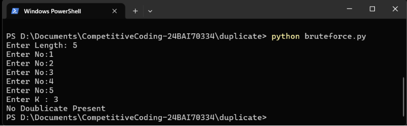
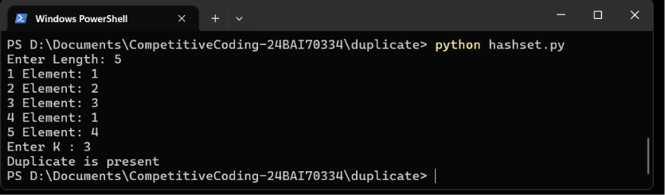
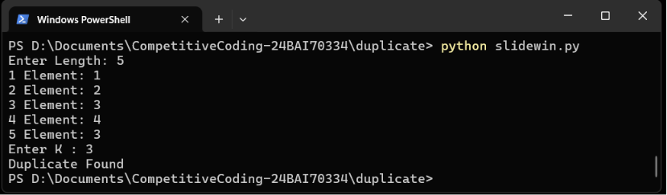

# DSA Problem Solutions

This repository contains Python implementations of common Data Structures and Algorithms (DSA) techniques.

## Files

| File | Description |
|------|-------------|
| `bruteforce.py` | Solution using the brute force approach. Usually the simplest implementation with higher time complexity. |
| `hashset.py` | Optimized solution using a HashSet for faster lookups and improved time complexity. |
| `slidewin.py` | Optimized solution using the Sliding Window technique for efficient subarray/substring processing. |

## Approaches

### 1. Brute Force
- Checks every possible case.
- Easy to understand.
- Higher time complexity.

### 2. HashSet
- Uses a hash-based data structure for constant-time lookups.
- Improves efficiency compared to brute force.

### 3. Sliding Window
- Maintains a moving window over the data.
- Reduces unnecessary computations.
- Often achieves linear time complexity.

## Screenshots



### Brute Force


### HashSet


### Sliding Window


> **Note:** Replace the image filenames with your actual screenshot names if they differ.

## Language

- Python 3

## How to Run

Run any solution using:

```bash
python bruteforce.py
```

or

```bash
python hashset.py
```

or

```bash
python slidewin.py
```

## Purpose

This repository demonstrates multiple approaches to solving the same problem, progressing from a straightforward brute-force solution to more optimized techniques.