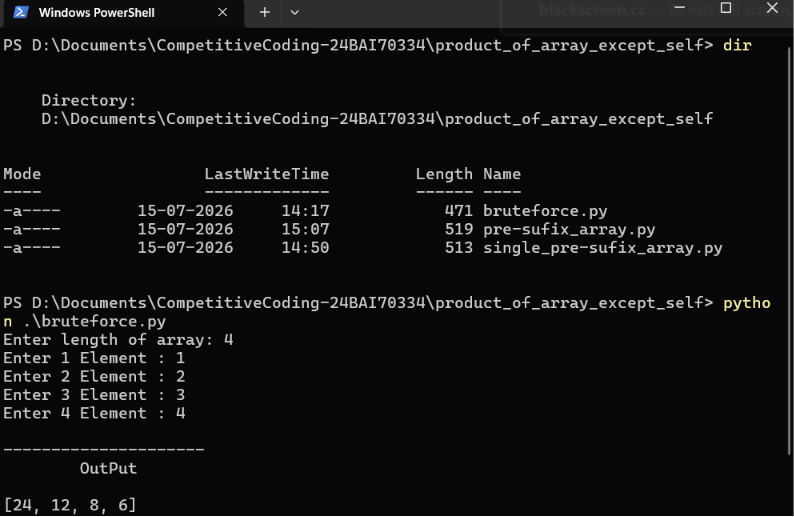
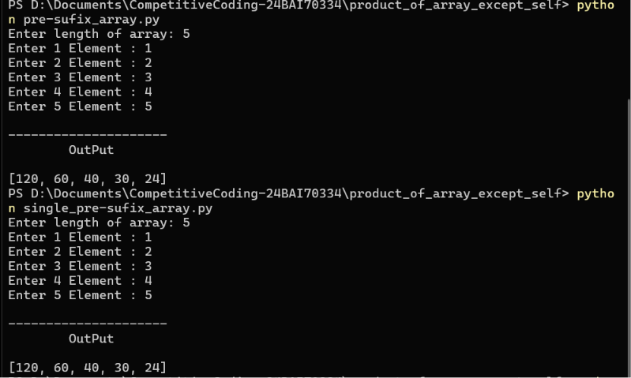

# Product of Array Except Self

This repository contains multiple Python solutions for the **Product of Array Except Self** problem, demonstrating different approaches with varying space complexities.

## Files

| File | Description |
|------|-------------|
| `bruteforce.py` | Brute force solution that computes the product for each index by iterating through the entire array. |
| `pre-sufix_array.py` | Optimized solution using separate prefix and suffix arrays. |
| `single_pre-sufix_array.py` | Space-optimized solution using a single output array with prefix and suffix traversal. |

## Approaches

### 1. Brute Force
- Compute the product of all elements except the current one.
- Easy to understand.
- Higher time complexity.

**Time Complexity:** `O(n²)`  
**Space Complexity:** `O(1)`

---

### 2. Prefix & Suffix Arrays
- Store prefix products in one array.
- Store suffix products in another array.
- Multiply corresponding prefix and suffix values.

**Time Complexity:** `O(n)`  
**Space Complexity:** `O(n)`

---

### 3. Single Prefix & Suffix Array
- Store prefix products directly in the output array.
- Traverse from the end while maintaining a suffix product.
- Eliminates the need for an extra suffix array.

**Time Complexity:** `O(n)`  
**Space Complexity:** `O(1)` *(excluding the output array)*

## Screenshots




> **Note:** Replace the image filenames if your screenshots use different names.

## Language

- Python 3

## How to Run

Run any solution using:

```bash
python bruteforce.py
```

or

```bash
python pre-sufix_array.py
```

or

```bash
python single_pre-sufix_array.py
```

## Project Structure

```text
.
├── README.md
├── bruteforce.py
├── pre-sufix_array.py
├── single_pre-sufix_array.py
└── screenshots/

```

## Purpose

This repository demonstrates how the **Product of Array Except Self** problem can be solved using progressively optimized approaches, from a simple brute-force implementation to an efficient prefix/suffix solution with constant extra space.